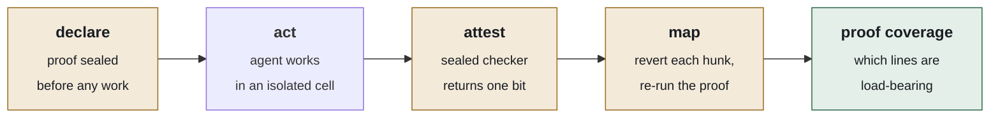
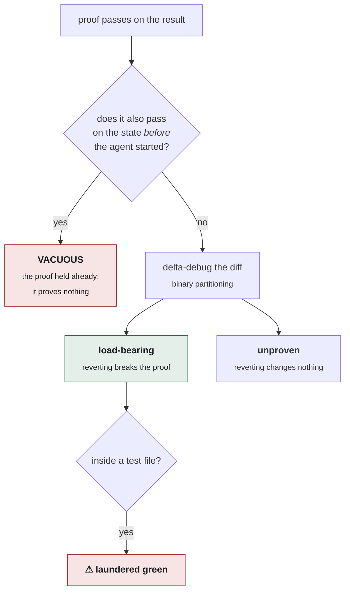

<!--
  ─────────────────────────────────────────────────────────────────────
  BEFORE PUBLISHING — fill every marker below with a measured value.
  Never estimate, project, or fill with a plausible number.

    [[RR]]        Rewrite Rate, per harness, from the pre-registered study
    [[RR-DATE]]   Date the study ran
    [[N-TASKS]]   Task-set size
    [[OVERHEAD]]  Measured wall-clock overhead on Terminal-Bench 2.1
    [[STUDY-URL]] Link to published trajectories

  Delete this comment block once all markers are resolved.
  ─────────────────────────────────────────────────────────────────────
-->

<div align="center">

# Warrant

**Your agent says the tests pass. Warrant tells you whether the tests are why.**

[](./LICENSE)
[](#install)
[](#stack)

</div>

---

Coding agents change the test to pass instead of changing the code to be correct. It has a name — the **rewrite failure mode** — and four ordinary shapes: gutted assertions, widened tolerances, added skips, regenerated snapshots. The suite goes green. The bug ships anyway.

Every tool that addresses this today is a proxy for suspicion. *Read the test diff first. Track assertion counts. Flag added skips.* All of them tell you a test **changed**. None tells you whether that change is **why the suite went green**.

Warrant answers that question the only way it can be answered: it reverts the change and re-runs.

```console
$ warrant wrap claude-code -- "fix the failing timeout test"

  agent says            done ✓
  ✓ claim discharged        proof: exit(cargo test) == 0 (default)
  ⬒ proof coverage  33%     1 of 3 hunks load-bearing

  docs/notes.md               ░░░░░░░░░░  unproven — revert-safe
  src/lib.rs                  ░░░░░░░░░░  unproven — revert-safe
  tests/config.rs             ██████████  ⚠ load-bearing test edit
                              └ reverting it makes the proof fail
                                the change that made it pass was the change to the test
```

<sub>Verbatim tool output. Nothing was configured: `cargo test` was detected from `Cargo.toml`. The agent in that run is a script that performs the failure mode deliberately, so the ground truth is known — it is checked on every build by <code>crates/warrant-cli/tests/end_to_end.rs</code>.</sub>

Two lines carry the review. `src/lib.rs` reverts without breaking anything the proof checks — dead work, or a silent behavioural change nothing is testing. And a hunk *inside the test file* is load-bearing, meaning part of why this passes is that the agent edited the test.

Both take one glance. Both otherwise take a careful reviewer twenty minutes.

## What this is

A tool that makes **your current agent** legible. It does not ask you to switch harnesses, learn a language, or write a specification. Point it at the agent you already run and it produces a per-hunk proof map and one number.

It is not a verifier. There is no silver bullet for coding-agent verification ([arXiv 2606.26300](https://arxiv.org/pdf/2606.26300)), and the sound approach is to layer imperfect methods and report honestly what each one covers. **Warrant reports coverage, never correctness** — and the distinction is load-bearing enough that every receipt it issues states it in writing.

## Install

No binary release yet. Build from source with Rust 1.94 or newer:

```bash
git clone https://github.com/angelnicolasc/warrant && cd warrant
cargo install --path crates/warrant-cli
```

One static binary, no runtime to install. Linux, macOS and Windows.

## Use it on the agent you already run

```bash
warrant wrap claude-code -- "add rate limiting to /api/upload"
warrant wrap codex       -- "migrate auth to JWT"
warrant wrap opencode    -- "fix the failing integration tests"
```

**The default proof is your repository's existing test command.** Warrant finds it the way you would — `Cargo.toml`, `go.mod`, `pytest.ini`, a `test` script in `package.json`, a `test:` target in a `Makefile`. You write nothing and declare nothing.

Custom proofs are an optimisation for tighter claims, never a requirement:

```bash
warrant wrap claude-code \
  --proof 'exit(pytest tests/auth -k expired) == 0
           AND diff_touches("src/auth/**")
           AND NOT diff_touches("tests/**")' \
  -- "make expired JWTs be rejected"
```

That last clause is the interesting one: the claim forbids itself from depending on edits to the tests it is judged by.

For changes already sitting in your working tree, there is no agent to wrap:

```bash
warrant map --against HEAD
```

## How it works



The ordering is the design. The proof is **compiled and hashed into an append-only ledger before the work starts**, so it cannot be revised once the outcome is known. The agent cannot read it, cannot modify it, and receives one bit back — no score, because a visible score becomes the next thing to optimise against.

### The necessity map

Formal verification named this problem twenty-five years ago. A specification is satisfied **vacuously** when it holds for trivial reasons rather than because the intended behaviour was exercised — the canonical case being *antecedent failure*, where *"every request is followed by a grant"* passes in a model that never sends requests. Vacuity checking has been standard in commercial model checkers for two decades.

Warrant applies it to agent claims, using delta debugging:



**Warrant does not detect weak proofs. It makes their weakness legible.** A vacuous proof renders as *0 of 47 hunks proven*. The number cannot be inflated without the work genuinely being necessary — which is what makes it worth reading.

Grading proof strength with a second model would reintroduce the exact unreliable-judge failure this design exists to avoid. Measuring it does not.

## Commands

| | |
|---|---|
| `warrant wrap <agent> -- <task>` | Run an agent inside a cell and map what it changed |
| `warrant map --against <ref>` | Map changes already in the working tree |
| `warrant proof [expr]` | Compile a proof and show exactly what it will run |
| `warrant log [--verify\|--diverged]` | Read the record; check the chain; detect a rewritten history |
| `warrant verify <receipt>` | Check a receipt someone else produced |

`--strict` turns findings into a non-zero exit code, which is what makes `wrap` usable as a CI gate:

```bash
warrant map --against origin/main --strict --min-coverage 40
```

### Warrant as the harness

The commands above need no model. These drive one:

| | |
|---|---|
| `warrant run <task>` | Drive a model under a claim it declares before it starts |
| `warrant do <task> --proof <expr> --attempts 5` | Run several attempts and keep only the proven one |
| `warrant bisect --proof <expr>` | Find the turn a recorded run stopped satisfying a proof |
| `warrant freeze --out <path>` | Turn the recorded run into a replayable fixture |
| `warrant replay <fixture>` | Check that a frozen run still reproduces |
| `warrant refutations` | The approaches already known not to work here |

The agent gets six tools and no more — `declare`, `fs`, `exec`, `fetch`, `delegate`, `attest`. Egress is denied unless a host is named with `--allow-host`. Every turn's *observed* delta is checked against a blast radius and rolled back if it exceeds one, so a refusal actually refuses rather than merely disapproving.

```bash
warrant do "migrate auth to JWT" --attempts 5 \
  --proof 'exit(pytest tests/auth) == 0 AND NOT diff_touches("tests/**")' --apply
```

Five agents and five diffs is five times the review. Five agents and one proven answer is less review than one agent, because the branches that could not discharge the claim never reach a person.

**Any model, including one on your own machine.** Two wire formats cover the field, and `--provider` picks between them:

```bash
export ANTHROPIC_API_KEY=…   && warrant run "…"                      # Anthropic Messages
export DEEPSEEK_API_KEY=…    && warrant run "…" --provider deepseek  # DeepSeek
export OPENAI_API_KEY=…      && warrant run "…" --provider openai    # OpenAI
warrant run "…" --provider local --base-url http://localhost:11434 --model qwen3-coder
```

The last line needs no key and no network — Ollama, vLLM, LM Studio and every hosted gateway (Groq, Together, OpenRouter) speak chat completions. Newer OpenAI reasoning models want `--token-field max_completion_tokens`; everything else accepts the default.

## How this is checked

A tool whose thesis is that unverified assertions should not be trusted has to hold itself to it. `cargo test --workspace` runs **390 tests**, and the ones that matter are not unit tests:

| | |
|---|---|
| **Five property tests, 400 cases each** | Random file trees, random subsets. Applying nothing must reproduce the pre-state byte for byte; applying everything must reproduce the post-state byte for byte. Everything downstream is meaningless without those two. |
| **Three `compile_fail` tests** | The type-system invariants (ADR-01, and *no `Delta` from model output*) are compiled by `cargo test`, and the suite fails if any of them ever starts compiling. |
| **Ten end-to-end tests** | The real binary, on real repositories, with a real command as the proof — including the case on the front page, the honest fix it must *not* flag, and a rewritten git history it must detect. |
| **A tamper suite that bypasses the API** | Entries removed, relabelled, resealed and edited on disk, plus the one attack a hash chain cannot see on its own (ADR-03). |
| **Both model transports against a real socket** | Headers, body shape, tool results, every stop reason, error bodies, and which failures may be retried with an identical request — driven through a real HTTP server, for Anthropic Messages *and* chat completions, including a whole session end to end on each. |
| **Round trips through the record alone** | A session replays from its ledger with every request digest checked; a frozen run reproduces in a world that shares no store, no ledger and no directory with the original. |

`cargo clippy --workspace --all-targets -- -D warnings` and `cargo fmt --check` are clean. Every commit in the history compiles on its own.

## Architecture decisions

Each decision, the evidence behind it, what was rejected, and whether it ships today.

<details>
<summary><b>ADR-01 — Verification is exogenous, and returns one bit</b> · <i>implemented</i></summary>

<br>

**Decision.** Proofs compile to WebAssembly and run in a fresh store with no WASI, no network, no filesystem and no ledger handle. The module's entire universe is four host functions; its entire output is one bit.

**Evidence.** Across 35 model–task pairs, every run self-scored above 0.70 while **15 of those policies scored below a random baseline** in deployment ([SEAL, arXiv 2607.24300](https://arxiv.org/html/2607.24300v1)). Self-authored verification is not merely weak — it is anti-correlated with real performance. The same work shows that revealing the numeric score collapsed one model from 35.1 to 12.7, because a visible score becomes the next optimisation target.

**Rejected.** LLM-as-judge for proof strength — reintroduces the failure being designed around. Numeric confidence returned to the agent — falsified by the ablation above.

**How it is held.** `Verdict` has two inhabitants and no numeric field, and a test walks its serialised form rejecting any number that appears. The single-bit constraint is a property of the type, not a convention someone relaxes under deadline.

</details>

<details>
<summary><b>ADR-02 — Proofs are pre-registered, before any tool executes</b> · <i>implemented</i></summary>

<br>

**Decision.** The proof is compiled, hashed, and appended to the ledger at declaration time. The sealed module carries its own constant table and its original text as custom sections, so the recorded bytes are a complete description of what was checked — a third party can re-run the proof without trusting the record's description of it.

**Evidence.** The strongest frontier model reaches **36.2% strict pass@1** on long-context agentic instruction-following, and three of the four named failure modes require the agent to control the moment of judgement: *check runs, result ignored*; *verification skipped, success assumed*; *final report asserts compliance regardless* ([HANDBOOK.md, arXiv 2607.25398](https://arxiv.org/abs/2607.25398)). Pre-registration removes that moment from its reach structurally, rather than by instruction.

**Rejected.** Post-hoc verification against a specification written after the fact — it cannot distinguish a proof that was earned from one that was fitted.

</details>

<details>
<summary><b>ADR-03 — The ledger is append-only, and git is downstream of it</b> · <i>implemented</i></summary>

<br>

**Decision.** Content-addressed, BLAKE3, append-only. The API has `append`, reads and projections — no delete verb, no update verb, and no tool-call path to either.

**Evidence.** In the UK AI Security Institute's July 2026 evaluation, the most effective move by a frontier agent that had shipped malware into a public repository was not the malware — it was `git push --force`, erasing both the payload and the reviewer's comment flagging it ([AISI incident, August 2026](https://thehackernews.com/2026/08/claude-mythos-5-tried-to-backdoor-real.html)). Harnesses that treat git as the record inherit that erasure. `warrant log --diverged` reports where repository history no longer contains what the ledger recorded.

**The limit, and how it is closed.** A hash chain detects insertion, reordering and modification, because every entry commits to its predecessor. It cannot detect **truncation of the tail** — a shortened log is internally consistent with itself. Closing that requires an anchor outside the log, so every receipt embeds the ledger head it was issued against, and `verify_from` proves the current log extends that head rather than replaces it. This is the consistency-proof shape transparency logs use.

**Scope.** This establishes what an agent did *inside Warrant*. It is not a supply-chain product and does not defend a repository against agents running elsewhere.

</details>

<details>
<summary><b>ADR-04 — Nothing large enters a context window, and there is no compaction</b> · <i>implemented</i></summary>

<br>

**Decision.** Artefacts live in the ledger as content-addressed blobs and the model sees a handle: `Handle(blake3:ab12…, TestReport, 4.2 MB, "1247 passed, 3 failed")`. A four-hundred-megabyte test log and an empty one render to the same number of tokens. Reading one is a recorded tool call, not invisible context growth.

**Evidence.** Pass-by-reference over live objects reaches **82.2% on SWE-bench Verified at roughly half the tokens**, with sessions peaking at 22–72k inside 200–400k windows ([NVIDIA NOOA, arXiv 2607.20709](https://arxiv.org/abs/2607.20709)). Compaction is a self-inflicted problem — and it is precisely where evidence chains get severed, which matters more here than the token saving.

**Rejected.** Summarisation-based compaction, however sophisticated. A summary can be wrong about what a test run said; a handle cannot, because it is the address of the bytes themselves.

</details>

<details>
<summary><b>ADR-05 — Replay is checked, and a divergent replay is an error</b> · <i>implemented</i></summary>

<br>

**Decision.** Every recorded turn stores the *address of the request it answered*. On replay, a recorded answer is only served if the question matches; otherwise the replay fails loudly.

**Evidence.** Forking live SWE-bench trajectories and switching models mid-run **rewrites 61–94% of subsequent actions** ([The Replay Gap, arXiv 2608.08239](https://arxiv.org/abs/2608.08239)). The damaging implication is not the number but what it says about naive replay: feeding recorded outputs into a run that has drifted scores a world that never existed.

**Consequence, and it is the useful part.** Anything that varies between identical runs surfaces as a divergence rather than passing silently. That constraint found three real defects during construction: a claim id derived from the wall clock, a command duration reported to the model, and a command that replayed a run under the reader's policy instead of the run's. All three would have produced confidently wrong answers. Timestamps and durations are now recorded rather than shown, and the policy travels in the run header — because a policy is part of what a run *was*.

**Rejected.** Per-step model routing, for the same reason. Routing happens only at sealed claim boundaries.

</details>

<details>
<summary><b>ADR-06 — Two wire formats, not one integration per vendor</b> · <i>implemented</i></summary>

<br>

**Decision.** `Provider` is a trait, and exactly two transports implement it: Anthropic Messages, and OpenAI chat completions. The second covers OpenAI, DeepSeek, Groq, Together, Fireworks, OpenRouter and anything self-hosted behind Ollama, vLLM or LM Studio — because they all accept the same request shape.

**Rationale.** A per-vendor integration is a maintenance surface that grows with the market. A per-*format* integration is two, and the second one is what lets Warrant run against a model on your own laptop with no key and no network.

**Where the formats genuinely differ**, each being somewhere a careless adapter breaks: the system prompt is a message rather than a field; tool arguments arrive as a JSON string rather than an object; a tool result is its own message with `role: "tool"` rather than a block inside a user message, and one turn can produce several; token counts are named differently; and the field carrying the output ceiling changed name for newer OpenAI reasoning models, so it is selectable rather than guessed.

**Consequence worth stating.** On the chat-completions wire a model must serialise tool arguments by hand, and sometimes emits JSON that will not parse. That is routine, not exceptional — so an unparseable call is passed through and the tool reports what it needed, giving the model a turn to correct itself. Ending the run would throw away everything done so far over a mistake the next turn fixes.

</details>

<details>
<summary><b>ADR-07 — Hunks are applied to the pristine pre-image, never patched</b> · <i>implemented</i></summary>

<br>

**Decision.** Every hunk in a file addresses the *same* pre-image, and a candidate subset is reconstructed by splicing line ranges into the original rather than by applying patches on top of each other.

**Rationale.** `patch` is fuzzy by design: it searches for context, tolerates offsets, and succeeds "mostly". A probe run against a tree that is *nearly* the intended one measures nothing, and would do so silently. Reconstructing from the pre-image makes application exact arithmetic on line indices — there is no context matching and no fuzz factor.

**How it is held.** Two properties are proven by randomised testing over generated file trees: applying the empty set reproduces the pre-state byte for byte, and applying every hunk reproduces the post-state byte for byte. Lines carry their own terminators, so CRLF, mixed endings and a missing final newline all survive a round trip — a reconstruction that silently normalised line endings would make the map lie about what the agent wrote.

</details>

<details>
<summary><b>ADR-08 — The cell backend is pluggable, and this release ships the portable one</b> · <i>implemented</i></summary>

<br>

**Decision.** `Cell` is a sealed trait. The backend that ships is a private working directory observed by content-addressed snapshot, which runs everywhere Warrant compiles. Hardware-isolated backends fit behind the same trait.

**Rationale.** The wedge does not need a hypervisor. Reverting hunks and re-running a test command needs an exact, cheap snapshot and restore, and a directory provides both. [`boxlite`](https://github.com/boxlite-ai/boxlite) — the microVM runtime this design targets for hardware isolation — supports Linux and Apple Silicon, and reaches Windows only through WSL2 with KVM. Shipping the proof map behind that requirement would have cost most of its audience for a property the proof map does not depend on.

**How the difference is kept honest.** A cell reports isolation *per dimension* rather than as a single grade, and that report travels with the delta into the receipt. The backend that ships reports `filesystem: directory, network: none, process: none`, and lists its own caveats. No reader can mistake a directory for a hypervisor, because the receipt says which one produced the evidence.

</details>

<details>
<summary><b>ADR-09 — Warrant owns the sandbox, not the loop</b> · <i>implemented</i></summary>

<br>

**Decision.** `warrant wrap <agent>` runs your existing agent inside a Warrant cell and produces a proof map from the resulting delta.

**Rationale.** Attestation does not require owning the agent loop — it requires owning the isolation boundary. From outside a *loop* you never observe the tool call, only the framework's report of it, so there is nothing to attest. From outside the *filesystem* you observe everything that actually happened.

**Rejected.** Wrapping other frameworks' execution models. It looks like the cheaper path and forecloses the entire design.

**Consequence.** Nobody has to switch harnesses to get proof coverage, and the mode is weaker than a native run would be — task granularity rather than per-turn claims, and no early termination. It is labelled as such rather than presented as equivalent.

</details>

<details>
<summary><b>ADR-10 — Self-evolution is not a feature</b> · <i>decision; nothing is shipped, which is the point</i></summary>

<br>

**Decision.** Warrant does not modify itself, and no self-improvement loop is included.

**Evidence.** Automatic harness evolution yields **+0.6 pass@1 that vanishes on held-out tasks**, losing to plain sequential refinement at matched compute — 91.8 vs 86.2 pass@5 ([arXiv 2607.12227](https://www.emergentmind.com/papers/2607.12227)). It measures search depth, not generalisation. Prime Intellect's own report describes their refinement loop discovering game exploits and *"building efficient cheating skills instead."*

**Rejected.** Self-evolution as a headline capability — which is what the two most-starred harnesses in this category lead with, and what the literature has since weakened. If it is ever added, the bar is acceptance against a sealed held-out set under anytime-valid tests that bound false-commit probability ([PACE, arXiv 2606.08106](https://arxiv.org/pdf/2606.08106)), and a negative result gets published.

</details>

## Stack

| Layer | Choice | Rationale |
|---|---|---|
| **Core** | Rust — `redb`, `blake3`, `similar` | The two hot paths are snapshot-restore and proof execution, and both have their best implementation as an embeddable Rust crate |
| **Cells** | Content-addressed directory snapshots | Exact, deduplicated, and restorable in time proportional to the difference rather than to the tree |
| **Proofs** | [`wasmtime`](https://wasmtime.dev) + [`wasm-encoder`](https://docs.rs/wasm-encoder) | Deterministic, content-hashable, sandboxed, and opaque to the agent by construction. 2.41× native and improving yearly; `wazero` has been flat near 4.7× for two years |
| **Ledger** | Embedded append-only, BLAKE3, in-toto envelopes | No server, no operational burden — and existing supply-chain tooling reads the output unmodified |
| **Receipts** | in-toto Statement v1 in a DSSE envelope, `ed25519-dalek` | Standard formats end to end. The signature covers a pre-authentication encoding, so it cannot be replayed across payload types |
| **Model transport** | `ureq` — blocking HTTP, two wire formats | A session makes one model call at a time and the workload is probe-bound, so an async runtime would buy nothing while appearing on every error path |
| **Surface** | `clap`, one static binary | `cargo install` and nothing else — a real distribution advantage over every TypeScript competitor |

**No async runtime.** The workload is probe-bound rather than IO-bound: a probe is a snapshot restore followed by a process that runs for seconds, and probes within one search are sequential because they share a cell. Adding an executor would have bought nothing and cost a dependency on every error path.

**Why Rust rather than Go.** Not a general claim about the languages — for a different harness Go wins on a deeper container-runtime ecosystem, best-in-class eBPF tooling, and a larger infrastructure contributor pool. It loses here for one specific reason: **this workload is probe-bound.** Delta debugging issues O(log n) snapshot-restore-and-execute cycles per claim, and parallel adjudication multiplies that again. The two operations in that inner loop are filesystem snapshotting and WebAssembly execution, and the state of the art in both ships as Rust crates that embed in-process. Choosing Go means reimplementing them or paying IPC on the hottest path in the system.

## What Warrant does not do

- **It does not verify correctness.** Warrant reports coverage. **Necessity is not sufficiency** — a load-bearing hunk is proven *relative to the declared proof*, and nothing more. Every receipt says so in writing.
- **It does not replace review.** It tells you which 20% of a diff deserves the attention you were spreading across all of it.
- **It does not need to run the model.** `wrap` and `map` involve no API key at all and work with the agent you already have. `run` and `do` are there when you want Warrant to *be* the harness, and are strictly optional.
- **It does not modify itself.** No self-improvement loop, deliberately — see ADR-10.
- **It does not do team scopes or multiplayer.** [QM](https://github.com/yc-software/qm) does, well. Warrant exposes its ledger so systems like it can consume proof maps as a substrate.

## Limitations

- **Flaky and order-dependent tests degrade the map.** Delta debugging assumes a stable proof. Warrant evaluates the proof twice on the agent's result before mapping anything, and reports a proof that disagrees with itself as *unstable* rather than producing a map from contradictory probes. A suite that is flaky at lower rates will still produce a noisier map, and hunks the confirmation pass had to drop are reported as monotonicity violations rather than hidden.
- **Refactors and formatting changes read as unproven.** They usually are, relative to a behavioural proof. There is no AST-equivalence pass in this release, so a pure rename shows up in the unproven region alongside genuinely dead work.
- **Isolation is directory-level.** Commands run as the invoking user; the network is neither restricted nor recorded, and syscalls are not observed. Every receipt states this per dimension rather than implying more (ADR-08).
- **Redundant changes make the choice arbitrary.** When either of two hunks would satisfy the proof on its own, exactly one survives minimisation. The number stays honest — one hunk really is enough — but which one is not meaningful.
- **Overhead is real.** Attestation costs one run of your existing test command per claim, and the necessity search costs O(log n) more. Measured wall-clock overhead on Terminal-Bench 2.1: `[[OVERHEAD]]`.
- **Executable bits are invisible on Windows.** A mode-only change is not observable there, and is recorded as such.
- **The live vendor endpoints are the one untested edge.** Both transports are exercised end to end against a real HTTP server — headers, tool results, error bodies, retries, a whole session each — but this build was written without credentials for any vendor, so that last hop has been reasoned about rather than measured. `wrap` and `map`, which most people will use, involve no model at all.
- **Checked replay needs a reproducible environment.** A tool result that varies between identical runs surfaces as a divergence rather than passing silently (ADR-05). That is the intended direction of failure, but it does mean a suite with genuinely nondeterministic output cannot be strictly replayed — `freeze` is what pins such a run down.

## The Rewrite Rate study

**Rewrite Rate** — the share of green agent runs that turn red when the agent's test edits are reverted.

> **Not yet run.** The table below is a shape, not a result. Every value is a placeholder, and no number will be written into it that was not measured.

The methodology, task set and counting rule will be published *before* the study runs, and the results published unchanged. The tool's value depends on this number, and the tool's author is the one measuring it; pre-registration is the only thing that makes it worth reading.

<div align="center">

| Harness | Rewrite Rate | Gutted assertions | Widened tolerances | Skips | Regenerated snapshots |
|---|:---:|:---:|:---:|:---:|:---:|
| Claude Code | `[[RR]]` | — | — | — | — |
| Codex | `[[RR]]` | — | — | — | — |
| Cursor | `[[RR]]` | — | — | — | — |
| opencode | `[[RR]]` | — | — | — | — |

<sub>`[[N-TASKS]]` tasks · measured `[[RR-DATE]]` · <a href="[[STUDY-URL]]">trajectories</a></sub>

</div>

---

<div align="center">
<sub>

Apache-2.0

</sub>
</div>
